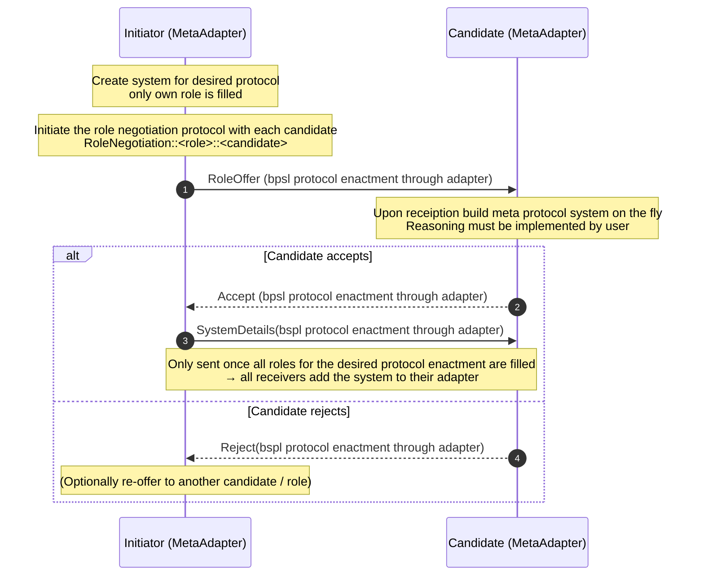

# Repo for my Masterthesis on interaction protocols in hypermedia environments
## How to run
To run this demo you need to have this specific version of bspl installed in you python environment. 
```bash
cd bspl
pip install -e .
```
Move back to the root of this repo and install the other dependencies.
```bash
cd ..
pip install -r requirements.txt
```
Then you can start the environment and the bazaar agent.
```bash
cd HypermediaInteractionProtocols
./start.sh
```
Afterward you can start the buyer agent in another terminal.
```bash
cd agents
python buyer_agent.py
```
You should be able to see that the buyer agent will first join the workspace and discover other agents as well as protocols.
The buyer agent then uses the metaprotocol to dynamically instantiate a new system for the buy protocol.
Once the metaprotocol is finished and the system is well-formed, the buyer will initiate the buy protocol.

## Current caveats
- Currently starting from the point where buyer agent knows the name of protocol needed to achieve goal
- When proposing the system the agent currently just knows what role to use
- Additional semantics are currently added to the artifacts not the agents itself
- How to initiate the protocol, currently hardcoded reaction once the system is well-formed

## What we can do
### Dynamic role binding through role binding metaprotocol
Introduced a universally known metaprotocol that allows agents to dynamically bind roles for any protocol.
For this we extended the bspl adapter to be able to handle metaprotocols. Specifically we first changed the adapter 
implementation to be able to handle addition of new protocols, systems, and agents at runtime. The meta adapter then
additionally implements the metaprotocol logic. The meta adapter has two additional stores for proposed systems 
and a mapping between ongoing role negotiations and proposed systems. To allow for more dynamic behavior when starting 
a meta protocol, when an agent receives an initial message to start a role negotiation it will build the system necessary
on the fly on his side.


Each agent must implement its reactor / handler for what to do when receiving a RoleOffer message.


### Discovery of new protocols and agents
Discovery is done through hypermedia traversal and with the new api of the meta adapter these newly discovered protocols
and agents can easily be added to the adapter at runtime.


## Scenario

Some user agent wants to buy a rug from some store. There exist two stores; the bazaar and the supermarket.
A storeclerk agent exists in both stores. The rug can be bought from either store, but the interaction is slightly different.
In the bazaar the interaction entails some negotiation about the price, whereas in the store it is fixed.

**Goal**

The user agent should be able to buy the rug from either store. He must achieve this without prior knowledge of the _environment_.
Meaning the _protocols_, _agents_ and other _artifacts_ are not known at compile time and must be discovered at runtime.

## Main questions to answer

### Agent
- [X] Allow agents to find new protocols -> enable hypermedia controls
  - Achieved through designated specifier in workspace
- [X] Agents need to know what roles other agents are capable off -> agent representation
  - Achieved through semantic description of agents in workspace
- [X] Agents also need to reason on new protocols -> Can they particpate in them? Can they enact some role?
  - Achieved on per agent basis through internal reasoning component
    - Currently very simple, but can be extended. Bazaar agent simply checks if it knows protocol

### Environment

- [x] need Hypermedia environment where agents can live -> Yggdrasil

### Other questions

#### BSPL Ontology

[current ontology](https://github.com/KaiTries/MasterThesis/blob/main/testing/bspl.ttl)

[Buy protocol expressed as RDF](https://github.com/KaiTries/MasterThesis/blob/main/testing/buy.ttl)
### BSPL protocol extensions

- [ ] BSPL Ontology so that it can be used in knowledge graphs
- [ ] Possible semantic extensions to allow linking -> a GoodRelations:Offer might want to say bspl:usesProtocol
- [ ] Translator that does BSPL <-> RDF
## Useful resources

- [collection of ontologies](https://lov.linkeddata.es/dataset/lov)
- [GoodRelations ontology](https://www.heppnetz.de/projects/goodrelations/primer/)