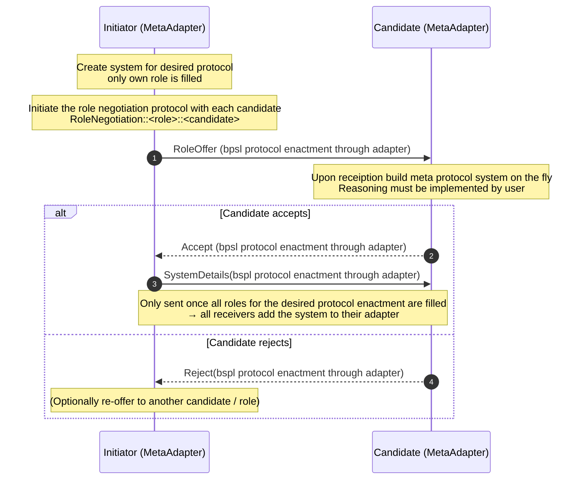

# Interaction Protocol and Hypermedia based Multi-Agent Systems


## Motivating Scenario
> AI-Agents browsing the web is a common occurrence nowadays and a vital functionality for these agents is
to be able to conduct transactions. Therefore, our scenario is a simple but illustrative buy scenario, where
a user agent will have the goal to buy a specific item - *a rug*. The user agent will then autonomously discover its
environment and through interactions with other agents buy the wanted item for the user. The user agent does this with initial knowledge
of only an **entrypoint**, an identifier for the **wanted item** and basic capabilities to respond to **buy specific messages**.

### How to run Scenario
Install base dependencies
```bash
pip install -r requirements.txt
```
To run this demo you need to have this specific version of bspl installed in you python environment. 
```bash
cd bspl
pip install -e .
```

Then you can start the environment and the bazaar agent.
```bash
cd ..
cd HypermediaInteractionProtocols
./start.sh
```
Afterward you can start the buyer agent in another terminal.
```bash
cd agents
python buyer_agent.py
```
You should be able to see that the buyer agent will first join the workspace and discover other agents as well as protocols.
The buyer agent then uses the metaprotocol to dynamically instantiate a new system for the buy protocol.
Once the metaprotocol is finished and the system is well-formed, the buyer will initiate the buy protocol.

### Highlights from Scenario 
####  Dynamic role binding through role binding metaprotocol
> We introduce a universally known [metaprotocol](docs/MetaProtocol.md) that allows agents to dynamically bind roles for any protocol.
For this we extended the bspl adapter to be able to handle metaprotocols. Specifically we first changed the adapter 
implementation to be able to handle addition of new protocols, systems, and agents at runtime. The meta adapter then
additionally implements the metaprotocol logic. The meta adapter has two additional stores for proposed systems 
and a mapping between ongoing role negotiations and proposed systems. To allow for more dynamic behavior when starting 
a meta protocol, when an agent receives an initial message to start a role negotiation it will build the system necessary
on the fly in its own adapter.


Each agent must implement its reactor / handler for what to do when receiving a RoleOffer message.

### Discovery of new protocols and agents
Discovery is done through hypermedia traversal and the use of semantic hypermedia. We use TD based descriptions for the agents and other environment entities.
To allow easier interaction between agents, each agent presents the roles they can enact in their description for others to see. Each agent also has an action affordance
that indicates the endpoint for the Adapter. For an agent to know what protocol to enact, some entities might link to a protocol. In our scenario, the hypermedia representation of the **rug** 
has a semantic link to the *buy protocol*. Through these semantics, the agent knows what protocol to enact and which agents he should ask for cooporation. 

