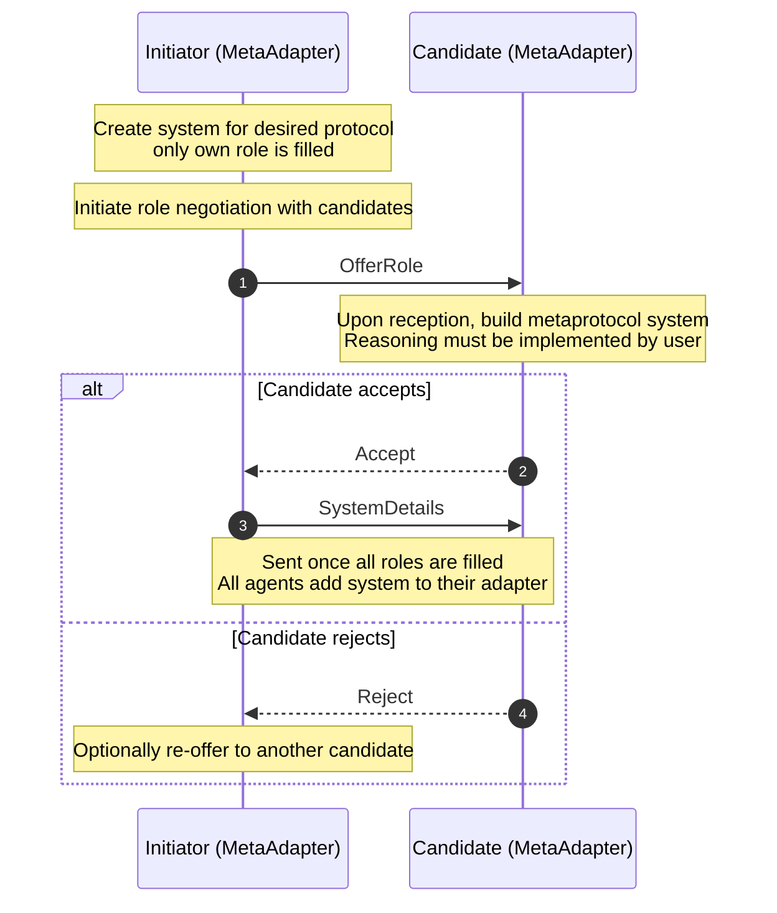

# Interaction Protocol and Hypermedia based Multi-Agent Systems

This project presents a novel approach to building autonomous multi-agent systems that combine **BSPL (Blindingly Simple Protocol Language) interaction protocols** with **hypermedia-driven discovery** and **dynamic role binding**. The system enables agents to autonomously discover their environment, negotiate roles, and collaborate through formally specified protocols without requiring centralized coordination.

## Table of Contents

- [Overview](#overview)
- [Key Concepts](#key-concepts)
- [Architecture](#architecture)
- [Getting Started](#getting-started)
- [Building Agents with MetaAdapter](#building-agents-with-metaadapter)
- [Demo Scenario](#demo-scenario)
- [Project Structure](#project-structure)

## Overview

Traditional multi-agent systems often rely on hardcoded agent configurations or centralized orchestration. This project introduces a decentralized approach where:

- **Agents discover protocols and other agents** through hypermedia traversal (using W3C Thing Descriptions)
- **Dynamic role negotiation** allows agents to form systems at runtime through a universal metaprotocol
- **Protocol compliance** is ensured through BSPL formal specifications
- **Hypermedia affordances** guide agent interactions and enable autonomous behavior

The system is particularly suited for scenarios requiring flexible, decentralized coordination between autonomous agents, such as e-commerce transactions, supply chain coordination, or any multi-party business process.

## Key Concepts

### BSPL (Blindingly Simple Protocol Language)

BSPL is a formal language for specifying interaction protocols. A protocol defines:
- **Roles**: Participants in the interaction (e.g., Buyer, Seller)
- **Parameters**: Information exchanged, with adornments (in/out/nil) and optionally marked as keys
- **Messages**: Communications between roles with specific parameter flows

**Example - Buy Protocol:**
```bspl
Buy {
  roles Buyer, Seller
  parameters out buyID key, out itemID key, out item, out money

  Buyer -> Seller: Pay[out buyID key, out itemID key, out money]
  Seller -> Buyer: Give[in buyID key, in itemID key, in money, out item]
}
```

BSPL ensures protocols are **enactable**, **dead-lock free**, and **information-safe** through formal verification.

### MetaAdapter

The `MetaAdapter` is an extension of the base BSPL `Adapter` that adds:

1. **Dynamic Protocol Management**: Add new protocols at runtime
2. **Dynamic System Formation**: Create protocol enactments with agents discovered at runtime
3. **Role Negotiation**: Built-in metaprotocol for proposing and accepting roles
4. **Capability-Based Role Matching**: Automatically determine which roles an agent can enact
5. **Agent Discovery Integration**: Add and manage agent addresses dynamically

### Role Negotiation Metaprotocol

A universally known metaprotocol enables agents to dynamically bind roles for any protocol:



### Hypermedia-Driven Discovery

Agents use **semantic hypermedia** (W3C Thing Descriptions) to discover:
- **Other agents** in the environment and their capabilities
- **Protocols** needed for specific goals (linked from resources)
- **Endpoints** for communication with other agents
- **Roles** that agents can enact

## Architecture

```
┌─────────────────────────────────────────────────────┐
│                 Agent Application                   │
├─────────────────────────────────────────────────────┤
│              MetaAdapter Layer                      │
│  • Role Negotiation                                 │
│  • Dynamic System Management                        │
│  • Capability Matching                              │
├─────────────────────────────────────────────────────┤
│              Base Adapter Layer                     │
│  • Protocol Enactment                               │
│  • Message Handling (Reactors/Generators)           │
│  • History & Integrity Management                   │
├─────────────────────────────────────────────────────┤
│           Communication Layer                       │
│  • Emitter (Send Messages)                          │
│  • Receiver (Receive Messages)                      │
└─────────────────────────────────────────────────────┘
         ↕                        ↕
  [Other Agents]          [Hypermedia Environment]
```

## Getting Started

### Prerequisites

- Python 3.8+
- Java (for Yggdrasil environment)
- Gradle (for building Yggdrasil)

### Installation

1. Install base dependencies

```bash
pip install -r requirements.txt
```

2. Build and add the environment provider (Yggdrasil)

```bash
cd yggdrasil
./gradlew
cd ..
mv yggdrasil/build/libs/yggdrasil-0.0.0-SNAPSHOT-all.jar HypermediaInteractionProtocols/env
```

3. Install custom BSPL version with MetaAdapter

```bash
cd bspl
pip install -e .
```

## Building Agents with MetaAdapter

This tutorial demonstrates how to build autonomous agents using the `MetaAdapter` class. We'll use the buyer and seller agents from the demo as reference.

### Step 1: Initialize Your Agent

```python
from bspl.adapter import MetaAdapter

# Configuration
NAME = "MyAgent"
ENDPOINT_PORT = 8011
SELF = [('127.0.0.1', ENDPOINT_PORT)]

# Define what messages your agent can send (capabilities)
# Capabilities are message names that your agent implements
capabilities = {"Pay", "AcceptOrder"}  # Example capabilities

# Create the MetaAdapter
adapter = MetaAdapter(
    name=NAME,
    systems={},  # Start with no systems (add dynamically)
    agents={NAME: SELF},  # Start with only self in address book
    capabilities=capabilities,
    debug=False
)
```

### Step 2: Define Message Handlers (Capabilities)

Message handlers react to incoming messages. Use the `@adapter.reaction()` decorator:

```python
@adapter.reaction("Give")
async def handle_give_message(msg):
    """Handle incoming Give messages from the Buy protocol"""
    adapter.info(f"Received item: {msg['item']}")
    adapter.info(f"Order {msg['buyID']} completed!")
    return msg
```

You can also define **enabled message generators** that automatically bind parameters when messages become enabled:

```python
@adapter.enabled("Buy/Give")
async def auto_send_give(msg):
    """Automatically send Give when enabled after receiving Pay"""
    adapter.info(f"Received payment for {msg['itemID']}")
    # Bind the 'item' parameter
    return msg.bind(item=msg['itemID'])
```

### Step 3: Add Protocols Dynamically

Once you discover a protocol (e.g., from hypermedia), add it to your adapter:

```python
import bspl

# Load protocol from string or file
protocol_string = """
Buy {
  roles Buyer, Seller
  parameters out buyID key, out itemID key, out item, out money

  Buyer -> Seller: Pay[out buyID key, out itemID key, out money]
  Seller -> Buyer: Give[in buyID key, in itemID key, in money, out item]
}
"""

# Parse and add protocol
spec = bspl.load(protocol_string)
protocol = spec.protocols['Buy']
adapter.add_protocol(protocol)

# The adapter automatically determines which roles you can enact
# based on your declared capabilities
```

### Step 4: Discover and Add Other Agents

```python
from helpers import get_agents

# Get agents from hypermedia environment
agents = get_agents(workspace_url, own_artifact_address)

# Add discovered agents to address book
for agent in agents:
    adapter.upsert_agent(agent.name, agent.addresses)
```

### Step 5: Propose a System and Negotiate Roles

```python
# Define the system you want to create
system_dict = {
    "protocol": protocol,
    "roles": {
        "Buyer": NAME,        # Your agent takes Buyer role
        "Seller": None        # Seller role to be negotiated
    }
}

# Propose the system (internal tracking)
proposed_system_name = adapter.propose_system("BuySystem_1", system_dict)

# Offer roles to discovered agents
await adapter.offer_roles(system_dict, proposed_system_name, agents)
```

The metaprotocol handles the negotiation automatically:
- Candidates with matching capabilities will accept
- When all roles are filled, all agents receive system details
- The system becomes ready for protocol enactment

### Step 6: Initiate Protocol Messages

```python
import asyncio

# Wait for the system to be well-formed (all roles filled)
await asyncio.sleep(5)  # Or implement proper waiting logic

if adapter.proposed_systems.get_system(proposed_system_name).is_well_formed():
    # Create message parameters
    params = {
        "system": proposed_system_name,
        "buyID": "order_123",
        "itemID": "rug",
        "money": 100
    }

    # Initiate the protocol
    await adapter.initiate_protocol("Buy/Pay", params)
else:
    adapter.info("System not well-formed, cannot initiate protocol")
```

### Step 7: Start the Adapter

```python
# Start in existing event loop (non-blocking)
async def main():
    adapter.start_in_loop()
    # Your agent logic here
    # ...

asyncio.run(main())

# OR start with dedicated event loop (blocking)
if __name__ == "__main__":
    adapter.start()
```

### Complete Agent Example

Here's a minimal working seller agent:

```python
from bspl.adapter import MetaAdapter
import bspl

# Configuration
NAME = "SellerAgent"
SELF = [('127.0.0.1', 8010)]
capabilities = {"Give"}

# Create adapter
adapter = MetaAdapter(
    name=NAME,
    systems={},
    agents={NAME: SELF},
    capabilities=capabilities,
    debug=True
)

# Define capability
@adapter.enabled("Buy/Give")
async def send_give(msg):
    adapter.info(f"Received order for {msg['itemID']}, sending item...")
    return msg.bind(item=msg['itemID'])

# Main logic
async def main():
    # Load protocol
    protocol_str = """
    Buy {
      roles Buyer, Seller
      parameters out buyID key, out itemID key, out item, out money
      Buyer -> Seller: Pay[out buyID key, out itemID key, out money]
      Seller -> Buyer: Give[in buyID key, in itemID key, in money, out item]
    }
    """
    spec = bspl.load(protocol_str)
    adapter.add_protocol(spec.protocols['Buy'])

    # Start adapter
    adapter.start_in_loop()

    # Agent stays alive and handles incoming messages
    while True:
        await asyncio.sleep(1)

if __name__ == "__main__":
    import asyncio
    asyncio.run(main())
```

### Advanced Features

**Custom Role Proposal Handling:**

The MetaAdapter has default handlers for role negotiation, but you can override them:

```python
# Override the default role proposal handler
@adapter.reaction("RoleNegotiation/OfferRole")
async def custom_role_handler(msg):
    proposed_role = msg['proposedRole']
    protocol_name = msg['protocolName']

    # Custom logic to decide acceptance
    if should_accept(proposed_role, protocol_name):
        await adapter.send(
            adapter.meta_protocol.messages["Accept"](
                uuid=msg['uuid'],
                system=msg.system,
                protocolName=msg['protocolName'],
                systemName=msg['systemName'],
                proposedRole=msg['proposedRole'],
                accept=True
            )
        )
    else:
        # Send reject...
        pass
    return msg
```

**Accessing System Information:**

```python
# Get a specific system
system = adapter.systems.get_system("BuySystem_1")
print(f"Roles: {system.roles}")
print(f"Protocol: {system.protocol.name}")

# Check if system is well-formed
if system.is_well_formed():
    adapter.info("All roles assigned!")

# Access proposed systems (during negotiation)
proposed = adapter.proposed_systems.get_system(proposed_system_name)
```

## Demo Scenario

### Motivating Scenario

> AI-Agents browsing the web is a common occurrence nowadays and a vital functionality for these agents is
> to be able to conduct transactions. Therefore, our scenario is a simple but illustrative buy scenario, where
> a user agent will have the goal to buy a specific item - _a rug_. The user agent will then autonomously discover its
> environment and through interactions with other agents buy the wanted item for the user. The user agent does this with initial knowledge
> of only an **entrypoint**, an identifier for the **wanted item** and basic capabilities to respond to **buy specific messages**.

### How to Run the Demo

1. Start the environment and bazaar agent:

```bash
cd HypermediaInteractionProtocols
./start.sh
```

This starts:
- **Yggdrasil** (hypermedia environment on port 8080)
- **Bazaar Agent** (seller agent on port 8010)

2. Open a new terminal and start the buyer agent:

```bash
cd HypermediaInteractionProtocols/agents
python buyer_agent.py
```

### What Happens in the Demo

1. **Buyer joins workspace**: The buyer agent joins the bazaar workspace through hypermedia
2. **Protocol discovery**: Buyer discovers the Buy protocol linked from the goal item (rug)
3. **Agent discovery**: Buyer discovers the bazaar agent (seller) in the workspace
4. **Protocol addition**: Buyer adds the Buy protocol and determines it can enact the "Buyer" role (has "Pay" capability)
5. **System proposal**: Buyer proposes a system with itself as Buyer and Seller role unfilled
6. **Role negotiation**: Buyer offers the Seller role to the bazaar agent via the metaprotocol
7. **Role acceptance**: Bazaar agent accepts (has "Give" capability)
8. **System formation**: Once all roles are filled, both agents receive system details
9. **Protocol enactment**: Buyer initiates the Buy protocol by sending Pay message
10. **Transaction completion**: Seller responds with Give message, completing the transaction

**Console Output** shows:
- Agent joining/leaving workspace
- Protocol and agent discovery
- Role negotiation messages
- Protocol messages (Pay/Give)
- Transaction completion

### Demo Implementation Details

**Buyer Agent** (HypermediaInteractionProtocols/agents/buyer_agent.py:1-134):
- Joins workspace via hypermedia
- Discovers Buy protocol from goal item semantics
- Discovers and adds other agents
- Proposes system and negotiates roles
- Initiates the Buy protocol

**Bazaar/Seller Agent** (HypermediaInteractionProtocols/agents/bazaar_agent.py:1-137):
- Registers with workspace on startup
- Adds Buy protocol and advertises "Seller" role capability
- Responds to role offers via default metaprotocol handler
- Automatically sends Give message when Pay is received (enabled message generator)

### Key Features Demonstrated

#### Dynamic Role Binding

The metaprotocol allows agents to form systems without prior coordination:
- **Decentralized**: No central authority assigns roles
- **Flexible**: Agents can join/leave systems dynamically
- **Capability-based**: Agents accept roles based on their advertised capabilities
- **Protocol-agnostic**: Works with any BSPL protocol

#### Hypermedia-Driven Discovery

Agents discover everything they need through hypermedia:
- **Protocols**: Linked from goal items using semantic annotations
- **Agents**: Discovered by traversing workspace artifacts
- **Capabilities**: Agents advertise their roles in Thing Descriptions
- **Endpoints**: Communication addresses discovered from action affordances

#### Protocol Compliance

BSPL ensures correct protocol execution:
- **Message ordering**: Only enabled messages can be sent
- **Parameter flow**: Information flows correctly between messages
- **Integrity checking**: Duplicate/invalid messages are rejected
- **Deadlock freedom**: Protocols are verified to be enactable

## Project Structure

```
MasterThesis/
├── README.md
├── requirements.txt
│
├── bspl/                           # BSPL core library
│   ├── src/bspl/
│   │   ├── adapter/
│   │   │   ├── core.py            # Base Adapter class
│   │   │   ├── meta_adapter.py    # MetaAdapter with role negotiation
│   │   │   ├── system_store.py    # System management
│   │   │   ├── agent_store.py     # Agent address book
│   │   │   ├── receiver.py        # Message reception
│   │   │   ├── emitter.py         # Message emission
│   │   │   └── ...
│   │   ├── protocol.py            # Protocol, Message, Role classes
│   │   ├── parsers/               # BSPL parser
│   │   └── verification/          # Protocol verification
│   ├── scenarios/                 # Example BSPL scenarios
│   └── samples/                   # Sample BSPL protocols
│
├── HypermediaInteractionProtocols/ # Demo implementation
│   ├── agents/
│   │   ├── buyer_agent.py         # Buyer agent implementation
│   │   ├── bazaar_agent.py        # Seller agent implementation
│   │   ├── helpers.py             # Hypermedia utility functions
│   │   └── semantics_helper.py    # Semantic reasoning helpers
│   ├── env/
│   │   ├── protocols/
│   │   │   └── buy.bspl          # Buy protocol specification
│   │   └── yggdrasil-*.jar       # Hypermedia environment
│   └── start.sh                   # Startup script
│
└── yggdrasil/                     # Hypermedia environment source
```

### Core Components

**MetaAdapter** (`bspl/src/bspl/adapter/meta_adapter.py:48-269`)
- Extends base Adapter with dynamic capabilities
- Implements role negotiation metaprotocol
- Manages proposed systems and negotiations
- Capability-based role matching

**Base Adapter** (`bspl/src/bspl/adapter/core.py:79-753`)
- Protocol enactment engine
- Message handling (reactors/generators)
- History and integrity checking
- Event-driven architecture

**Protocol Classes** (`bspl/src/bspl/protocol.py:1-734`)
- Protocol, Message, Role, Parameter definitions
- BSPL parsing and validation
- Protocol instantiation and resolution

**Hypermedia Helpers** (`HypermediaInteractionProtocols/agents/helpers.py:1-260`)
- W3C Thing Description parsing
- Workspace join/leave operations
- Protocol and agent discovery
- RDF/Turtle processing

## Further Reading

- **BSPL Specification**: See `bspl/` for detailed protocol language documentation
- **Metaprotocol**: Role negotiation protocol is defined in `bspl/src/bspl/adapter/meta_adapter.py:8-24`
- **Sample Protocols**: Browse `bspl/samples/` for more BSPL protocol examples
- **W3C Thing Descriptions**: [WoT TD Specification](https://www.w3.org/TR/wot-thing-description/)

## License

This project is part of a Master's Thesis research on autonomous multi-agent systems.
