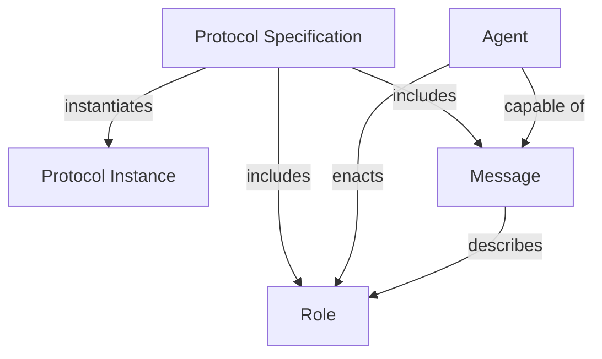
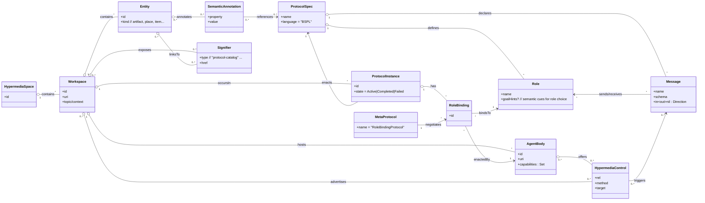

# Draft for the Metamodel - Discovery and Enactment of Interaction Protocols in Dynamically Open Settings

## Metamodel Draft

```mermaid
graph TD
    A[Protocol Specification] -->|instantiates| B[Protocol Instance]
    A -->|includes| C[Message]
    A -->|includes| D[Role]
    E[Agent] -->|enacts| D
    E -->|capable of| C
    C -->|describes| D


```

### Metamodel of BSPL part

```mermaid
graph TD
    A[Protocol Specification] -->|instantiates| B[Protocol Instance]
    A -->|includes| C[Message]
    A -->|includes| D[Role]
    E[Agent] -->|enacts| D
    E -->|capable of| C
    C -->|describes| D


```

### Metamodel of Hypemedia part

```mermaid
classDiagram
 direction LR

 %% --- Hypermedia layer ---
 class HypermediaSpace {
   +id
 }
 class Workspace {
   +id
   +uri
   +topic/context
 }
 class Entity {
   +id
   +kind  // artifact, place, item...
 }
 class AgentBody {
   +id
   +uri
   +capabilities : Set<MessageName>
 }
 class HypermediaControl {
   +rel
   +method
   +target
 }
 class SemanticAnnotation {
   +property
   +value
 }

 HypermediaSpace "1" o-- "*" Workspace : contains
 Workspace "1" o-- "*" Entity : contains
 Workspace "1" o-- "*" AgentBody : hosts
 Entity "0..*" o-- "0..*" SemanticAnnotation : annotates
 AgentBody "0..*" o-- "0..*" HypermediaControl : offers
 Workspace "0..*" o-- "0..*" HypermediaControl : advertises

 %% --- Protocol specification (BSPL/IOSE) ---
 class ProtocolSpec {
   +name
   +language = "BSPL"
 }
 class Role {
   +name
   +goalHints?  // semantic cues for role choice
 }
 class Message {
   +name
   +schema
   +in~out~nil : Direction
 }

 ProtocolSpec "1" o-- "*" Role : defines
 ProtocolSpec "1" o-- "*" Message : declares
 Role "*" <-- "*" Message : sends/receives

 %% --- Discovery + Binding + Enactment ---
 class ProtocolInstance {
   +id
   +state = Active|Completed|Failed
 }
 class RoleBinding {
   +id
 }
 class MetaProtocol {
   +name = "RoleBindingProtocol"
 }

 Workspace "1" o-- "*" ProtocolInstance : occursIn
 ProtocolSpec "1" <-- "*" ProtocolInstance : enacts
 ProtocolInstance "1" o-- "*" RoleBinding : has
 RoleBinding "*" --> "1" Role : bindsTo
 RoleBinding "*" --> "1" AgentBody : enactedBy
 MetaProtocol "1" --> "*" RoleBinding : negotiates

 %% --- Cues for in-context discovery ---
 class Signifier {
   +type  // "protocol-catalog" ...
   +href
 }
 Workspace "0..*" o-- "0..*" Signifier : exposes
 Entity "0..*" o-- "0..*" Signifier : linksTo
 SemanticAnnotation "0..*" --> "0..*" ProtocolSpec : references
 HypermediaControl "0..*" --> "0..*" Message : triggers


```
