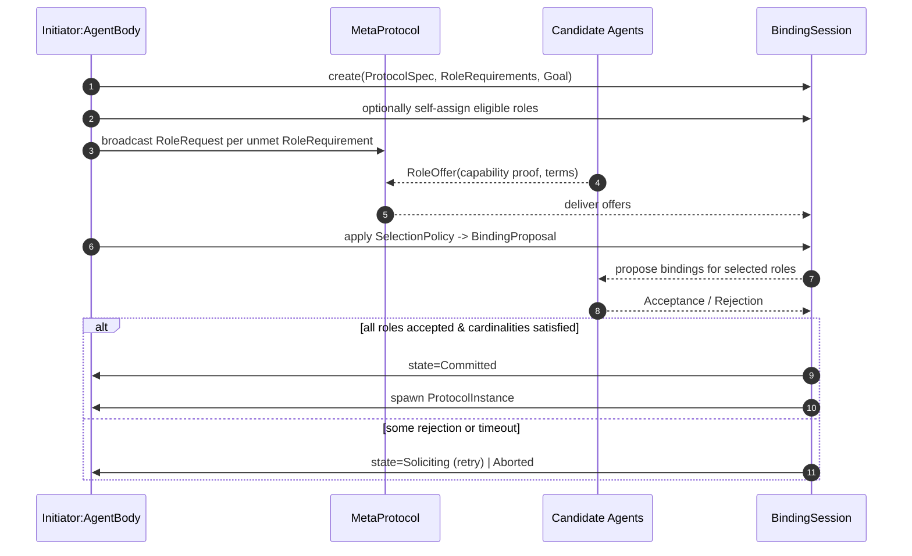

# Draft for the Metamodel - Discovery and Enactment of Interaction Protocols in Dynamically Open Settings

## Metamodel Draft

## simpler

The simple Idea is that entities exist in the hypermedia space, which is separated into workspace.
Workspaces tell us which protocols care available in the context of locality.
Entities in the workspace might reference protocols through semantic annotations.
A protocol consists of roles and messages, a role can be enacted by an agent.

The simple metamodel can describe the discovery of protocols, but fails to describe the dynamic binding of agents to roles,
as well as the role negotiation

## Metamodel - Only RoleBinding

## Maybe still too complicated

